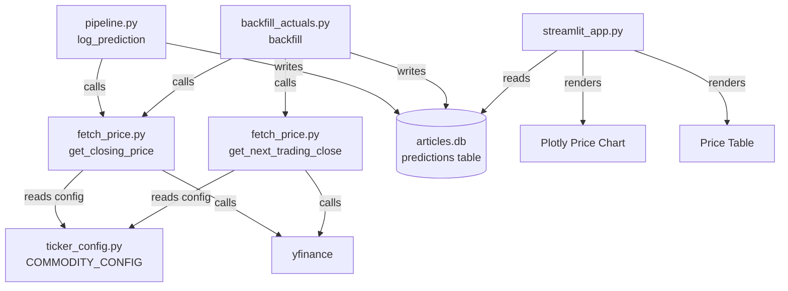

# Design Document: Price Recording

## Overview

The price-recording feature extends the Prediction Tracker by capturing real market prices at prediction time (entry) and the following trading day (exit). This enables accurate PnL calculation, price-derived `actual_move`, and a visual price chart in the Streamlit dashboard.

The design introduces three new modules (`ticker_config.py`, `fetch_price.py`) and modifies three existing ones (`init_tracker.py`, `backfill_actuals.py`, `pipeline.py`, `streamlit_app.py`). All yfinance calls are centralised in `fetch_price.py` — no other module may call yfinance for price data.

---

## Architecture



**Key constraint:** `fetch_price.py` is the single gateway to yfinance. `backfill_actuals.py` no longer calls yfinance directly; it delegates entirely to `fetch_price.py`.

---

## Components and Interfaces

### ticker_config.py

Single source of truth for commodity → yfinance ticker mappings.

```python
COMMODITY_CONFIG: dict[str, dict] = {
    "Dubai Crude (PCAAT00)": {"ticker_yf": "BZ=F", "unit": "barrel", "currency": "USD"},
    "Brent Dated (PCAAS00)": {"ticker_yf": "BZ=F", "unit": "barrel", "currency": "USD"},
    "WTI (PCACG00)":         {"ticker_yf": "CL=F", "unit": "barrel", "currency": "USD"},
    "LNG / Nat Gas (JKM)":   {"ticker_yf": "NG=F", "unit": "MMBtu",  "currency": "USD"},
    # Aliases for legacy rows
    "Dubai Crude":           {"ticker_yf": "BZ=F", "unit": "barrel", "currency": "USD"},
    "Brent":                 {"ticker_yf": "BZ=F", "unit": "barrel", "currency": "USD"},
    "WTI":                   {"ticker_yf": "CL=F", "unit": "barrel", "currency": "USD"},
    "LNG":                   {"ticker_yf": "NG=F", "unit": "MMBtu",  "currency": "USD"},
}

def get_ticker(commodity: str) -> str | None:
    """Return yfinance ticker for commodity, or None if unmapped."""
    cfg = COMMODITY_CONFIG.get(commodity)
    return cfg["ticker_yf"] if cfg else None
```

### fetch_price.py

All yfinance interactions live here.

```python
DEFAULT_LOT_SIZE = 1000

def get_closing_price(commodity: str, date: str) -> float | None:
    """
    Return the closing price for commodity on the given date (YYYY-MM-DD).
    Walks forward up to 5 calendar days to skip weekends/holidays.
    Returns None on any error or if no data found within 5 days.
    """

def get_next_trading_close(commodity: str, from_date: str) -> tuple[float | None, str | None]:
    """
    Return (closing_price, actual_date) for the first trading day strictly
    after from_date, walking forward up to 5 calendar days.
    Returns (None, None) on any error or if no data found.
    """
```

**Walk-forward algorithm** (shared by both functions):
1. Parse `date` → `datetime`.
2. For `offset` in `1..5` (for `get_next_trading_close`) or `0..4` (for `get_closing_price`):
   - Compute `candidate = date + timedelta(days=offset)`.
   - Call `yf.download(ticker, start=candidate, end=candidate + 1 day, ...)`.
   - If `df` is non-empty, return `float(df["Close"].iloc[0])` and `candidate.strftime(...)`.
3. Return `None` / `(None, None)` after exhausting 5 days.

### init_tracker.py

Modified to add new columns via `ALTER TABLE` migration when the table already exists.

```python
NEW_COLUMNS = [
    ("entry_price",    "REAL"),
    ("exit_price",     "REAL"),
    ("price_currency", "TEXT DEFAULT 'USD'"),
    ("price_unit",     "TEXT"),
    ("ticker_yf",      "TEXT"),
]

def init_tracker(conn: sqlite3.Connection) -> None:
    # 1. CREATE TABLE IF NOT EXISTS with all columns (new installs)
    # 2. For each column in NEW_COLUMNS, attempt ALTER TABLE ADD COLUMN
    #    (SQLite ignores duplicate column errors via try/except)
```

### backfill_actuals.py

Refactored to use `fetch_price.py` exclusively. Removes the inline `TICKER_MAP` and `get_actual_move` function.

```python
from data.fetch_price import get_closing_price, get_next_trading_close, DEFAULT_LOT_SIZE

def backfill() -> None:
    # SELECT predictions WHERE exit_price IS NULL AND prediction_date <= date('now', '-1 day')
    # For each row:
    #   if entry_price IS NULL: fill via get_closing_price(commodity, prediction_date)
    #   exit_price, exit_date = get_next_trading_close(commodity, prediction_date)
    #   if exit_price is None: skip
    #   actual_move = round((exit_price - entry_price) / entry_price * 100, 2)
    #   pnl_usd = actual_move / 100 * entry_price * DEFAULT_LOT_SIZE
    #   UPDATE predictions SET exit_price, actual_move, pnl_usd, outcome WHERE id
```

### pipeline.py — log_prediction()

Extended to fetch and store `entry_price` and `ticker_yf` at log time.

```python
from data.fetch_price import get_closing_price
from data.ticker_config import COMMODITY_CONFIG

def log_prediction(commodity, ticker, result, headline=None):
    cfg = COMMODITY_CONFIG.get(commodity, {})
    ticker_yf = cfg.get("ticker_yf")
    entry_price = get_closing_price(commodity, date.today().isoformat()) if ticker_yf else None
    # INSERT OR IGNORE with entry_price and ticker_yf columns
```

### streamlit_app.py additions

Three new functions added to the Prediction Tracker tab:

```python
def load_price_history(commodity_filter, date_from, date_to) -> pd.DataFrame:
    """Query predictions with entry_price/exit_price for chart/table rendering."""

def render_price_chart(df: pd.DataFrame) -> None:
    """
    Plotly figure:
    - paper_bgcolor / plot_bgcolor = "rgba(0,0,0,0)"  (transparent)
    - Entry price: solid line, one trace per commodity
    - Exit price: dash="dash" line, one trace per commodity
    - Signal markers on entry line: triangle-up (bullish) / triangle-down (bearish)
      colored HIGH=#FF4B4B, MEDIUM=#FFA500, LOW=#21C354
    - If df empty: st.info("No price data available for the selected filters.")
    """

def render_price_table(df: pd.DataFrame) -> None:
    """
    Tabular view with columns: prediction_date, commodity, signal, direction,
    entry_price, exit_price, actual_move, outcome.
    NULL prices → "Pending". outcome color-coded via applymap.
    """
```

---

## Data Models

### predictions table (updated schema)

| Column           | Type    | Notes                                      |
|------------------|---------|--------------------------------------------|
| id               | INTEGER | PK AUTOINCREMENT                           |
| logged_at        | DATETIME| DEFAULT CURRENT_TIMESTAMP                  |
| prediction_date  | DATE    | NOT NULL                                   |
| commodity        | TEXT    | NOT NULL                                   |
| ticker           | TEXT    | Platts symbol (existing)                   |
| signal           | TEXT    | HIGH / MEDIUM / LOW                        |
| direction        | TEXT    | rise / fall / flat                         |
| confidence       | REAL    |                                            |
| expected_move    | TEXT    |                                            |
| headline         | TEXT    |                                            |
| actual_move      | REAL    | Computed: (exit-entry)/entry*100           |
| outcome          | TEXT    | correct / incorrect / NULL                 |
| pnl_usd          | REAL    | actual_move/100 * entry_price * 1000       |
| entry_price      | REAL    | NEW — closing price on prediction_date     |
| exit_price       | REAL    | NEW — closing price on next trading day    |
| price_currency   | TEXT    | NEW — DEFAULT 'USD'                        |
| price_unit       | TEXT    | NEW — e.g. 'barrel', 'MMBtu'              |
| ticker_yf        | TEXT    | NEW — yfinance ticker used for price fetch |
| UNIQUE           |         | (prediction_date, commodity)               |

### COMMODITY_CONFIG entry shape

```python
{
    "ticker_yf": str,   # yfinance symbol, e.g. "BZ=F"
    "unit":      str,   # e.g. "barrel"
    "currency":  str,   # e.g. "USD"
}
```

---

## Correctness Properties

*A property is a characteristic or behavior that should hold true across all valid executions of a system — essentially, a formal statement about what the system should do. Properties serve as the bridge between human-readable specifications and machine-verifiable correctness guarantees.*

### Property 1: Duplicate insert is silently ignored

*For any* `(prediction_date, commodity)` pair, inserting the same pair twice into the predictions table should result in exactly one row — the second insert is silently dropped.

**Validates: Requirements 1.4, 1.5**

---

### Property 2: Schema migration preserves existing data

*For any* predictions table that already contains rows and lacks the new price columns, running `init_tracker()` should add all five new columns while leaving every existing row intact and all pre-existing column values unchanged.

**Validates: Requirements 1.2**

---

### Property 3: Unmapped commodity returns None

*For any* string that is not a key in `COMMODITY_CONFIG`, calling `get_ticker(commodity)` should return `None`.

**Validates: Requirements 2.3**

---

### Property 4: Weekend and holiday walk-forward returns a weekday price

*For any* commodity in `COMMODITY_CONFIG` and any date that is a Saturday or Sunday, `get_closing_price` should return a price fetched from a subsequent weekday (Monday or later), not from the weekend date itself.

**Validates: Requirements 3.3, 8.1, 8.2**

---

### Property 5: Walk-forward never exceeds 5 calendar days

*For any* commodity and date where yfinance returns no data for 5 consecutive days, both `get_closing_price` and `get_next_trading_close` should return `None` / `(None, None)` without raising an exception.

**Validates: Requirements 3.4, 8.3**

---

### Property 6: log_prediction stores entry_price and ticker_yf

*For any* commodity in `COMMODITY_CONFIG`, after `log_prediction()` is called, the resulting predictions row should have `ticker_yf` equal to `COMMODITY_CONFIG[commodity]["ticker_yf"]` and `entry_price` equal to the value returned by `get_closing_price` (or NULL if it returned None).

**Validates: Requirements 4.1, 4.3**

---

### Property 7: Backfill selects only eligible predictions

*For any* predictions table state, the backfill query should select exactly those rows where `exit_price IS NULL` AND `prediction_date <= date('now', '-1 day')` — no more, no fewer.

**Validates: Requirements 5.1, 5.2**

---

### Property 8: actual_move formula correctness

*For any* pair of prices `(entry_price, exit_price)` where `entry_price > 0`, the computed `actual_move` should equal `round((exit_price - entry_price) / entry_price * 100, 2)` exactly.

**Validates: Requirements 5.4**

---

### Property 9: pnl_usd formula correctness

*For any* `actual_move` and `entry_price`, the computed `pnl_usd` should equal `actual_move / 100 * entry_price * 1000` exactly.

**Validates: Requirements 5.5**

---

### Property 10: Price chart respects active filters

*For any* combination of commodity filter and date range, every data point rendered in the price chart should have a `commodity` matching the filter and a `prediction_date` within the date range.

**Validates: Requirements 6.5**

---

### Property 11: NULL prices display as "Pending"

*For any* predictions row where `entry_price` or `exit_price` is NULL, the corresponding cell in the rendered price table should display the string `"Pending"`.

**Validates: Requirements 7.2**

---

### Property 12: Round-trip price consistency

*For any* valid commodity and trading date where market data exists, `get_closing_price(commodity, date)` and `get_next_trading_close(commodity, date)` should return two distinct non-None prices, with the second price corresponding to a date strictly after the first.

**Validates: Requirements 8.4**

---

## Error Handling

| Scenario | Behaviour |
|---|---|
| yfinance network error | `fetch_price.py` catches exception, logs warning, returns `None` / `(None, None)` |
| No market data within 5 days | Returns `None` / `(None, None)` — prediction row still inserted with NULL prices |
| Unmapped commodity | `get_ticker()` returns `None`; `log_prediction` skips price fetch, stores NULL |
| Duplicate `(prediction_date, commodity)` | `INSERT OR IGNORE` — row silently skipped, no exception |
| `entry_price = 0` in backfill | Division-by-zero guard: skip `actual_move` / `pnl_usd` computation, leave NULL |
| `ALTER TABLE` on existing column | SQLite raises `OperationalError`; `init_tracker` catches it per-column and continues |

---

## Testing Strategy

### Dual approach

Both unit tests and property-based tests are required. Unit tests cover specific examples, integration points, and error conditions. Property tests verify universal correctness across randomised inputs.

### Property-based testing library

Use **Hypothesis** (`pip install hypothesis`) — the standard PBT library for Python.

Each property test must run a minimum of **100 iterations** (Hypothesis default is 100; set `@settings(max_examples=100)`).

Each test must be tagged with a comment in the format:
`# Feature: price-recording, Property N: <property_text>`

### Property tests (one test per property)

| Property | Test description |
|---|---|
| P1 | Generate random `(date_str, commodity)` pairs; insert twice; assert `COUNT(*) == 1` |
| P2 | Create old-schema DB with random rows; run `init_tracker`; assert all rows intact and new columns present |
| P3 | Generate arbitrary strings not in `COMMODITY_CONFIG`; assert `get_ticker` returns `None` |
| P4 | Generate Saturday/Sunday dates; mock yfinance; assert returned date is a weekday |
| P5 | Mock yfinance to always return empty DataFrame; assert both functions return None after exactly 5 attempts |
| P6 | Mock `get_closing_price`; call `log_prediction` with random commodity; assert DB row has correct `ticker_yf` and `entry_price` |
| P7 | Insert rows with varied `exit_price` / `prediction_date` states; run backfill selection query; assert only eligible rows returned |
| P8 | Generate random `(entry, exit)` float pairs with `entry > 0`; assert formula holds to 2 decimal places |
| P9 | Generate random `(actual_move, entry_price)` floats; assert `pnl_usd` formula holds |
| P10 | Generate random DataFrames with mixed commodities/dates; apply filter; assert all chart traces contain only matching data |
| P11 | Generate DataFrames with NULL entry/exit prices; call render logic; assert "Pending" appears in output |
| P12 | For known commodities with live data, assert `get_next_trading_close` date > `get_closing_price` date |

### Unit tests

- `test_ticker_config.py`: verify all four required commodities are present with correct tickers
- `test_fetch_price.py`: mock yfinance; test happy path, empty response, exception path
- `test_init_tracker.py`: fresh DB gets all columns; existing DB gets migrated without data loss
- `test_backfill.py`: mock fetch functions; verify `actual_move` and `pnl_usd` computed correctly; verify NULL entry_price is backfilled first
- `test_streamlit_chart.py`: verify Plotly figure has solid/dashed traces and correct marker symbols/colors
